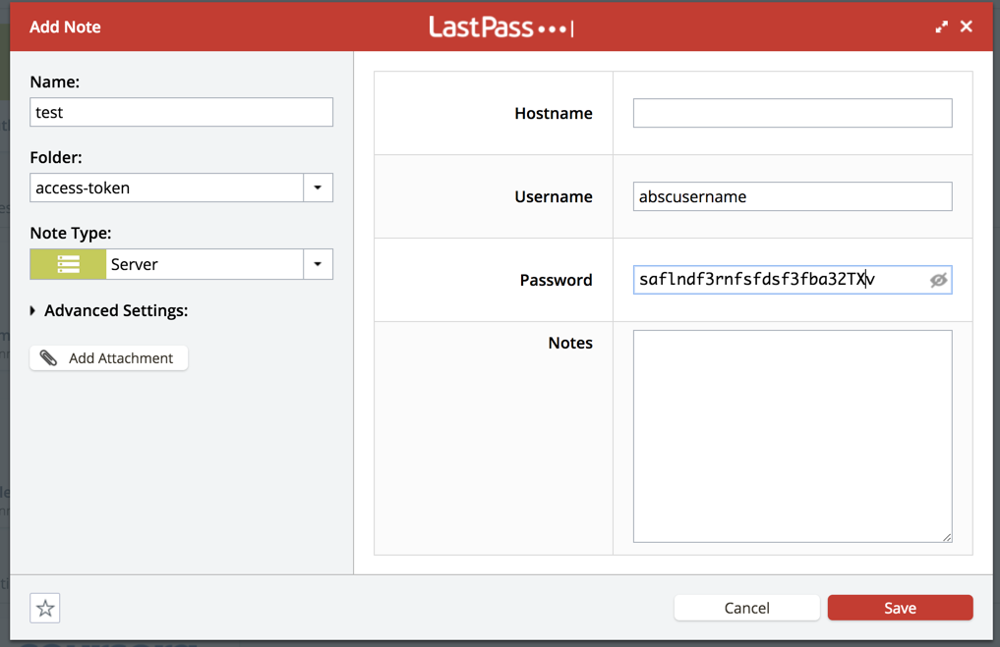

# Security and Safety

A development machine should be secured against threads as well as any other machine \(or even _especially_ a development machine\). Therefore we will setup

* secure system settings
* a virus scanner
* a firewall
* disk encryption

## Secure System Settings

Check out [Stronghold](https://www.github.com/alichtman/stronghold) for the easiest way to configure macOS security settings from the terminal.

## Virus Scanner

Head over to [Avira](https://www.avira.com/), download and install their latest free package.

## Firewall

This one is a bit controversial. If you do not install software which allows network access of any kind, skip it. If you run potentially vulnerable software you don't want to be accessed from other machines, consider turning the built-in firewall on. This particularly applies if you develop network software.

To turn the built-in firewall on:

1. Choose Apple menu \(\) &gt; System Preferences, then click Security & Privacy.
2. Click the Firewall tab.
3. Click the Lock button, then enter an administrator name and password.
4. Click Turn On Firewall.
5. Click Firewall Options.
6. Uncheck 'Automatically allow signed software to receive incoming connections'.

The last step disables automatic access for software from the App Store. From now on you can either add \(dis\)allowed programs to the list within the Firewall Options or just click on Allow\/Deny, if you get a popup asking you if a specific software may be accessed.

## Disk Encryption

Another controversial point. If you have a desktop machine in a secured building, you probably do not need disk encryption. If you travel a lot and take your notebook with you \(including all your source codes\), you might consider travelling with disk encryption enabled.

The following steps were taken from the [official apple support page](https://support.apple.com/en-us/HT204837) on this:

1. Choose Apple menu \(\) &gt; System Preferences, then click Security & Privacy.
2. Click the FileVault tab.
3. Click the Lock button, then enter an administrator name and password.
4. Click Turn On FileVault.
5. Follow the instructions. In my opinion you should create a local and offline possibility to disable encryption, when you are asked how to regain access in case of anything.

## Config & Keybase

also add terraform  

## LastPass

## Securely store your keys and secrets

You don't want to store your secrets in plain text in a file like `.rshrc`  therefore you can use lpass cli \[[github](https://github.com/lastpass/lastpass-cli) / [documentation](https://helpdesk.lastpass.com/lastpass-command-line-application/)\] and store your secrets in your osx keychain and access them only by reference.

### Installation

```bash
brew install lastpass-cli --with-pinentry
```

#### Set variables in lastpass

Just create a secret note within lastpass:



#### Login to lpass in the command line

```bash
# login to lastpass# check first if I am allready loggedin and finded the "access-token" folder if [[ $(lpass ls) != *"access-token"* ]]; thenlpass login your@email.comfi
```

#### Set environment variable \(e.g. key\_id \(username\) and secret\(password\)

```bash
export AWS_ACCESS_KEY_ID=$(lpass show aws-serverless-devops --username)
export AWS_SECRET_ACCESS_KEY=$(lpass show aws-serverless-devops --password)
```

### Accessing files in lpass

```text
lpass show xxx-dev-gcp --attach att-7942806310206912061-56085
```

### Setup an ecrypted folder and sync with google drive

```text
/Users/den/Desktop/secret/xxx/key.json
lock-secret-files
unlock-secret-files
```