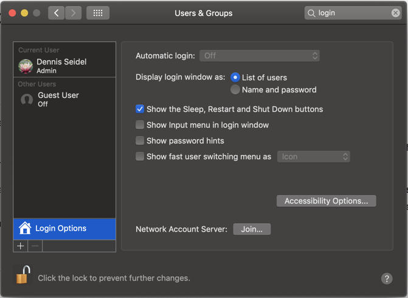
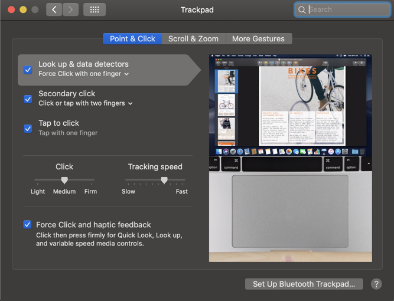
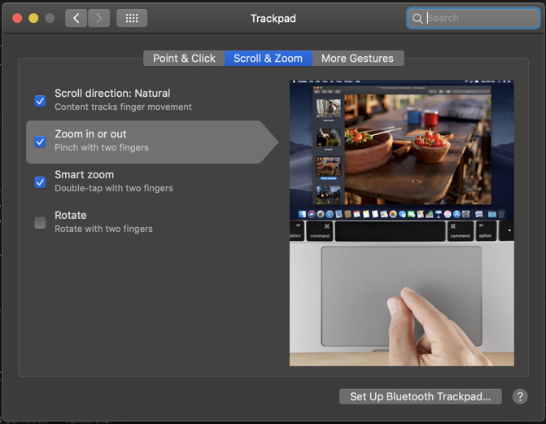
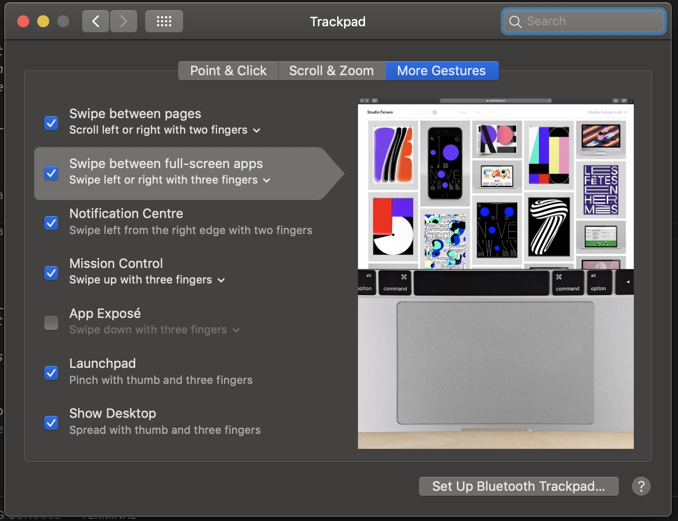
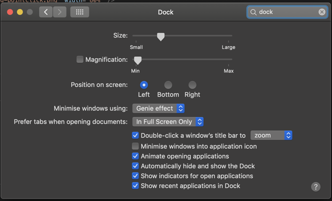

# System Preferences

## First Time Setup

The first thing you should do is update your system. To do that go:
**Apple menu () > About This Mac > Software Update.**

Also upgrade your OS to the latest version to have a more secure OS. macOS
upgrades are usually free so you might as well keep your machine up to date.

If this is a new computer there are a couple tweaks you could make to the
System Preferences. **These settings are all optional, consider them
suggestions. Always choose the setting that makes the most sense to you.**

## Users & Groups



## Trackpad







## Dock



## Finder

- General
    - Change _New finder window show_ to open in your _Google Drive Folder_
- Sidebar
    - Add _Home_ and your _Code Directory_
    - Uncheck all _Shared_ boxes

## Menubar

- Remove the _Display_ and _Bluetooth_ icons

## Spotlight

- Uncheck _fonts_, _images_, _files_ etc.

## Accounts

- Add an _iCloud & Google Accountß account_ and sync _Calendar_, _Find my Mac_, _Contacts_ etc.

## User Defaults

- Enable _repeating keys by pressing and holding down keys_ for terminal & visual studio code: `defaults delete -g ApplePressAndHoldEnabled && defaults write -app Terminal ApplePressAndHoldEnabled -bool false && defaults write com.microsoft.VSCode ApplePressAndHoldEnabled -bool false` (and restart any app
  that you need to repeat keys in)

## How to write to NTFS on macOS Yosemite (10.10) and El Capitan (10.11)

### 1) Install Homebrew and Homebrew Cask

Instructions [here](https://sourabhbajaj.com/mac-setup/Homebrew/README.html).

### 2) Update Homebrew formulae

    $ brew update

### 3) Install osxfuse

If you are on macOS El Capitan (10.11), install the (3.x.x) from [the
repo](https://github.com/osxfuse/osxfuse/releases).

    $ brew cask install osxfuse

### 4) Install ntfs-3g

    $ brew install ntfs-3g

### 5) If you are on macOS El Capitan (10.11), temporarily disable System Integrity Protection

 - **Reboot** and hold `CMD + R` to get in recovery mode
 - Open the terminal and type:

```shell
$ csrutil disable
```

 - **Reboot** normally

### 6) Create a symlink for mount_ntfs

```shell
$ sudo mv /sbin/mount_ntfs /sbin/mount_ntfs.original
$ sudo ln -s /usr/local/sbin/mount_ntfs /sbin/mount_ntfs
```

### 7) If you are on macOS El Capitan (10.11), re-enable System Integrity Protection

 - **Reboot** and hold `CMD + R` to get in recovery mode
 - Open the terminal and type:

```shell
$ csrutil enable
```

 - **Reboot** normally
